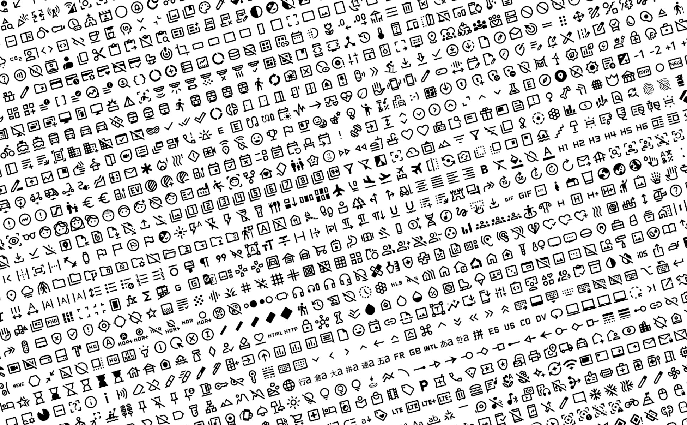

# Material Symbols for LaTeX



Check [introduction.pdf](/docs/introduction.pdf) for more documentations and usage examples.

This LaTeX package enables the easy integration of [Google's Material Symbols](https://fonts.google.com/icons) into LaTeX documents, supporting XeLaTeX and LuaLaTeX. It provides access to a wide range of icons in various styles, enhancing the visual appeal of documents.

## Prerequisites

- `XeLaTeX` or `LuaLaTeX`: This package is compatible with `XeLaTeX` and `LuaLaTeX` to utilize font features.

## Installation

1. Clone this repository or download the ZIP file.
2. Copy the package files into your LaTeX project directory or a location where LaTeX can find it.
3. Include the package in your LaTeX document preamble with `\usepackage{material-symbols}`.

## Usage

To use a symbol in your document, use the `\mSymbol{name}` command, where `name` is the kebab-case name of the symbol as defined in [Google Fonts](https://fonts.google.com/icons).

### Example

```latex
\documentclass{article}
\usepackage{material-symbols}

\begin{document}

Here is a Material Symbol: \mSymbol{sports-soccer}.

\end{document}
```

Refer to [source code of project's introduction.pdf](/example-main.tex) for more examples.

### Styles

To specify a style, use the optional argument:

- `\mSymbol[outlined]{icon-name}` for Outlined style.
- `\mSymbol[rounded]{icon-name}` for Rounded style.
- `\mSymbol[sharp]{icon-name}` for Sharp style.

## List of Icons

For a full list of available icons and their names, please refer to the included icon table in the [package documentation](docs/introduction.pdf) or visit [Google Fonts Site](https://fonts.google.com/icons).
